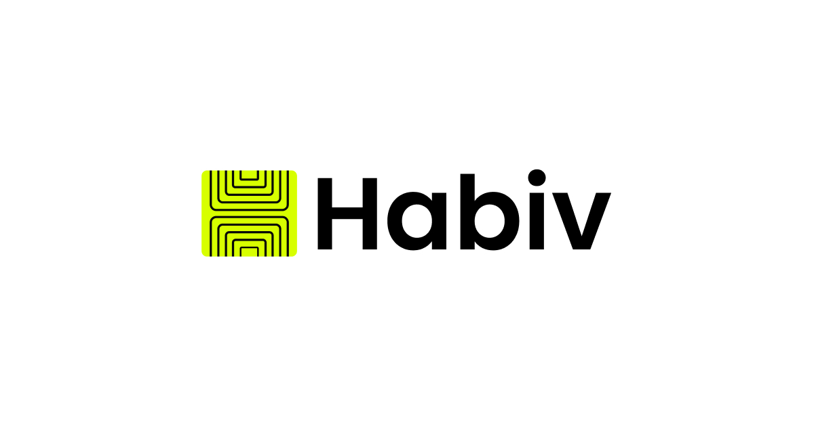

# Habiv.



### **AI Client Intake + AI Proposal Generation.**
**Let clients share project details through AI chat, then generate professional proposals instantly**

Habiv turns client conversations into signed contracts. It replaces the traditional contact form with an AI-driven intake chat that collects requirements, qualifies leads, and automatically generates professional, stunning proposals.

---

## 🚀 **Features**

### **1. Public Profile Page**
A specialized landing page for freelancers.
- **"Start a Project" Button**: Launches the AI intake chat.
- **Portfolio Showcase**: Display your best work.
- **Services & Bio**: Clear, professional presentation of what you do.

### **2. AI Client Intake**
Stop chasing clients for details.
- **Conversational AI**: Asks the right questions based on the client's initial input.
- **Structured Data Extraction**: Automatically identifies Budget, Timeline, Deliverables, and more.
- **Lead Qualification**: Filters out low-quality leads before they reach your inbox.

### **3. Instant Proposal Generation**
- **One-Click Proposals**: Turns chat data into a complete, formatted proposal.
- **Premium Design**: Proposals that look like they were designed by an agency.
- **Smart Customization**: AI learns from your past proposals to match your tone.

### **4. Client Dashboard**
- **Review & Edit**: Freelancers get a summarized view of the intake before vitalizing the proposal.
- **Track & Analyze**: See when clients view proposals and get notified instantly.

---

## 🛠 **Tech Stack**

- **Framework**: [Next.js 14+](https://nextjs.org/) (App Router)
- **Styling**: [Tailwind CSS](https://tailwindcss.com/) + [Framer Motion](https://www.framer.com/motion/)
- **UI Components**: [Shadcn/UI](https://ui.shadcn.com/)
- **AI**: [Vercel AI SDK](https://sdk.vercel.ai/docs) (OpenAI/Anthropic)
- **Database & Auth**: [Supabase](https://supabase.com/)

---

## ⚡ **Getting Started**

> This project is currently in **Active Development**.

### Installation

```bash
git clone https://github.com/NEER4J/habiv.git
cd habiv
npm install
npm run dev
```

---

<p align="center">
  &copy; 2025 Habiv. Built for the future of freelancing.
</p>